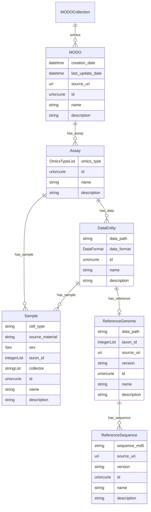

# modos-schema

Metadata schema for the Multi-Omics Digital Object System - [MODOS](https://github.com/sdsc-ordes/modos-api).

## Website

[https://sdsc-ordes.github.io/modos-schema](https://sdsc-ordes.github.io/modos-schema)

## Repository Structure

* [examples/](examples/) - example data
* [project/](project/) - project files (do not edit these)
* [src/](src/) - source files (edit these)
  * [modos_schema](src/modos_schema)
    * [schema](src/modos_schema/schema) -- LinkML schema
      (edit this)
    * [datamodel](src/modos_schema/datamodel) -- generated
      Python datamodel
* [tests/](tests/) - Python tests

## Developer Documentation

Use the `make` command to generate project artefacts:

* `make all`: make everything
* `make deploy`: deploys site

## Credits

This project was made with
[linkml-project-cookiecutter](https://github.com/linkml/linkml-project-cookiecutter).

## Acknowledgements and Funding

The development of the Multi-Omics Digital Object System (MODOS) is being funded by the Personalized Health Data Analysis Hub, a joint initiative of the Personalized Health and Related Technologies ([PHRT](https://www.sfa-phrt.ch)) and the Swiss Data Science Center ([SDSC](https://datascience.ch)), for a period of three years from 2023 to 2025. The SDSC leads the development of MODOS, bringing expertise in complex data structures associated with multi-omics and imaging data to advance privacy-centric clinical-grade integration. The PHRT contributes its domain expertise of the Swiss Multi-Omics Center ([SMOC](http://smoc.ethz.ch)) in the generation, analysis, and interpretation of multi-omics data for personalized health and precision medicine applications.
We gratefully acknowledge the [Health 2030 Genome Center](https://www.health2030genome.ch/) for their substantial contributions to the development of MODOS by providing test data sets, deployment infrastructure, and expertise. 

## Copyright
Copyright © 2023-2024 Swiss Data Science Center (SDSC), [www.datascience.ch](http://www.datascience.ch/). All rights reserved. The SDSC is jointly established and legally represented by the École Polytechnique Fédérale de Lausanne (EPFL) and the Eidgenössische Technische Hochschule Zürich (ETH Zürich). This copyright encompasses all materials, software, documentation, and other content created and developed by the SDSC in the context of the Personalized Health Data Analysis Hub.
